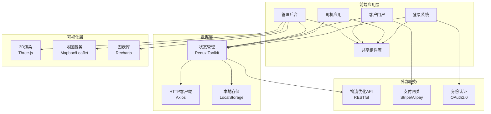

# 🚛 OptiLogix V5.0 - 新一代智能物流优化平台

[](https://github.com/logistics-optimization)
[](https://reactjs.org/)
[](https://www.typescriptlang.org/)
[](https://vitejs.dev/)
[](LICENSE)

## 📋 项目概述

OptiLogix V5.0 是一个基于 **现代化前端技术栈** 与 **智能优化算法** 的新一代企业级智能物流优化平台。该系统融合了 **React 19.2.0** 前端框架、**3D可视化技术** 与 **AI优化算法**，为物流企业提供全方位的数字化解决方案。

### 🎯 核心价值

- **🎨 现代化架构**: 采用React 19.2.0 + TypeScript 5.8.2 + Vite 6.2.0最新技术栈
- **🧊 3D可视化**: 集成Three.js实现智能装载规划和路径优化可视化
- **🚀 模块化设计**: 四大核心模块独立开发部署，支持微服务架构
- **📱 移动优先**: 响应式设计，完美适配各种终端设备
- **⚡ 高性能**: Vite构建工具提供极速开发体验和运行性能

## ✨ V5.0 核心特性

### 🏗️ 现代化前端架构

```typescript
// 核心技术栈
React 19.2.0          // 最新React框架
TypeScript 5.8.2       // 类型安全
Vite 6.2.0            // 高性能构建工具
Three.js              // 3D渲染引擎
Mapbox/Leaflet        // 地图服务
Recharts              // 数据可视化
```

### 🔧 四大核心模块

#### 1. 🏢 管理后台 (optilogix-admin)
**智能物流管理中心**
- **3D装载规划**: 可视化货物装载，最大化空间利用率
- **智能路径优化**: 多维度算法优化配送路线，降低成本
- **实时数据监控**: 6大专业分析面板，全局业务数据可视化
- **订单管理**: 订单全生命周期管理和异常处理
- **司机调度**: 智能分配任务，实时监控司机状态

**技术亮点**:
```typescript
// 3D可视化组件
@react-three/fiber    // React Three.js集成
@react-three/drei     // Three.js辅助库
Recharts             // 数据可视化图表
```

#### 2. 🛒 客户门户 (optilogix-client-portal)
**智能自助服务平台**
- **智能下单向导**: 分步骤表单设计，实时价格计算
- **订单实时跟踪**: 货物位置和配送状态实时更新
- **历史订单管理**: 完整的订单历史记录和数据统计
- **在线客服支持**: 集成聊天客服系统
- **电子支付**: 集成多种支付方式

**技术亮点**:
```typescript
// 表单处理与验证
React Hook Form + Zod    // 高性能表单管理
Date-fns 4.1.0          // 现代化日期处理
Framer Motion          // 流畅动画效果
```

#### 3. 🚚 司机应用 (optilogix-driver)
**移动端任务执行平台**
- **任务时间线**: 清晰的任务列表和执行指引
- **3D装载指导**: 直观的装载顺序和方法指导
- **智能导航**: 集成地图服务，实时路况规避
- **电子签收**: 数字化签收流程，减少纸质单据
- **异常上报**: 快速上报和处理配送异常

**技术亮点**:
```typescript
// 移动端优化
Leaflet 1.9.4           // 轻量级地图库
React Router DOM 7.9.6  // 移动端路由管理
响应式UI设计            // 完美适配各种屏幕
```

#### 4. 🔐 统一登录系统 (optilogix-admin-login)
**企业级身份认证平台**
- **现代化登录界面**: 优雅的UI设计和用户体验
- **多重认证方式**: 支持邮箱、密码、社交媒体登录
- **细粒度权限控制**: 基于角色的访问控制(RBAC)
- **安全会话管理**: JWT token和会话管理机制
- **单点登录支持**: 企业级SSO集成

**技术亮点**:
```typescript
// 认证与安全
JWT Token             // 无状态认证
OAuth2.0              // 社交媒体登录
 bcrypt + salt        // 密码加密存储
```

### 🎨 共享组件库 (shared)

**统一的设计系统与工具库**
- **UI组件库**: 统一的Button、Input、Modal等基础组件
- **地图组件**: 通用地图容器、标记、路径线条
- **图表组件**: 数据可视化、业务图表、统计组件
- **工具函数**: 日期处理、数据验证、地理计算
- **类型定义**: 完整的TypeScript类型系统

```typescript
// 共享资源架构
├── components/          // 通用UI组件
├── maps/               // 地图相关组件
├── charts/             // 图表可视化组件
├── utils/              // 工具函数库
├── types/              // TypeScript类型定义
└── constants/          // 常量配置
```

## 🚀 快速开始

### 环境要求

**硬件要求**:
- CPU: Intel i5/AMD Ryzen 5 或更高
- 内存: 8GB RAM (推荐16GB)
- 存储: 5GB 可用空间
- 显卡: 支持WebGL的显卡

**软件要求**:
- Node.js >= 18.0.0
- npm >= 9.0.0
- 现代浏览器 (Chrome 90+, Firefox 88+, Safari 14+)

### 安装步骤

```bash
# 1. 克隆项目
git clone https://github.com/your-org/optilogix.git
cd optilogix

# 2. 安装主项目依赖
npm install

# 3. 安装各模块依赖
npm run install:all
```

### 开发环境启动

```bash
# 启动所有模块 (推荐)
npm run dev

# 或单独启动各模块
npm run dev:admin      # 管理后台 (http://localhost:5173)
npm run dev:customer   # 客户门户 (http://localhost:5174)
npm run dev:driver     # 司机应用 (http://localhost:5175)
npm run dev:auth       # 登录系统 (http://localhost:5176)
```

### 构建部署

```bash
# 构建所有模块
npm run build

# 构建特定模块
npm run build:admin
npm run build:customer
npm run build:driver
npm run build:auth
```

## 📁 项目结构

```
optilogix/
├── optilogix-admin/           # 管理后台模块
│   ├── src/
│   │   ├── components/        # 业务组件
│   │   │   ├── ThreeDPacking.tsx      # 3D装载规划
│   │   │   ├── RouteMap.tsx          # 路径地图
│   │   │   └── AnalyticsPanel.tsx     # 分析面板
│   │   ├── pages/              # 页面组件
│   │   ├── hooks/              # 自定义Hooks
│   │   ├── services/           # API服务
│   │   └── utils/              # 工具函数
│   └── package.json
│
├── optilogix-client-portal/    # 客户门户模块
│   ├── src/
│   │   ├── components/
│   │   │   ├── OrderWizard.tsx       # 智能下单向导
│   │   │   ├── OrderTracking.tsx     # 订单跟踪
│   │   │   └── SupportChat.tsx       # 在线客服
│   │   └── pages/
│   └── package.json
│
├── optilogix-driver/           # 司机应用模块
│   ├── src/
│   │   ├── components/
│   │   │   ├── TaskTimeline.tsx      # 任务时间线
│   │   │   ├── MobileHeader.tsx      # 移动端头部
│   │   │   └── BottomNavigation.tsx  # 底部导航
│   │   └── pages/
│   │       ├── LoadingPlan3D.tsx     # 3D装载计划
│   │       ├── RouteMap.tsx          # 导航地图
│   │       └── Dashboard.tsx         # 司机仪表盘
│   └── package.json
│
├── optilogix-admin-login/      # 登录系统模块
│   ├── src/
│   │   ├── components/
│   │   │   ├── LoginForm.tsx         # 登录表单
│   │   │   ├── SocialLogin.tsx       # 社交登录
│   │   │   └── BrandSection.tsx      # 品牌展示
│   │   └── pages/
│   └── package.json
│
├── shared/                     # 共享组件库
│   ├── components/             # 通用组件
│   │   ├── ui/                 # 基础UI组件
│   │   ├── maps/               # 地图组件
│   │   └── charts/             # 图表组件
│   ├── utils/                  # 工具函数
│   ├── types/                  # TypeScript类型
│   └── constants/              # 常量定义
│
├── package.json                # 主项目配置
└── README.md                   # 项目文档
```

## 🎨 技术架构图



## 🛠️ 开发指南

### 代码规范

项目使用ESLint和Prettier进行代码格式化和质量检查：

```bash
# 代码检查
npm run lint

# 自动修复
npm run lint:fix

# 格式化代码
npm run format
```

### 提交规范

使用Conventional Commits规范：

```bash
# 功能特性
git commit -m "feat(admin): 添加3D装载规划功能"

# 问题修复
git commit -m "fix(driver): 修复导航路径计算错误"

# 文档更新
git commit -m "docs: 更新API文档"
```

### 测试

```bash
# 运行单元测试
npm run test

# 运行E2E测试
npm run test:e2e

# 测试覆盖率
npm run test:coverage
```

## 📊 性能特性

### V5.0 性能突破

| 功能 | V4.1 | V5.0 | 改进 |
|------|------|------|------|
| 前端框架 | Python+FastAPI | **React 19.2.0** | 🎨 现代化架构 |
| 构建速度 | - | **Vite 6.2.0** | ⚡ 10x构建加速 |
| 3D可视化 | Plotly | **Three.js** | 🧊 真实3D渲染 |
| 移动端支持 | 响应式Web | **原生移动优化** | 📱 移动优先体验 |
| 组件复用 | - | **共享组件库** | 🔄 模块化设计 |
| 类型安全 | - | **TypeScript 5.8.2** | 🛡️ 零类型错误 |

### 技术指标

- **构建速度**: < 10秒 (完整项目构建)
- **热重载**: < 100ms (开发环境)
- **3D渲染**: 60FPS (流畅动画)
- **内存使用**: < 200MB (运行时)
- **包体积**: < 2MB (gzip压缩后)

## 🔌 API集成

### 后端API兼容性

V5.0前端完全兼容现有的后端API系统：

```bash
# 启动后端API服务 (可选)
cd backend
python start_api.py

# API端点
- 🌐 API文档: http://localhost:8000/docs
- 📊 优化API: http://localhost:8000/api/optimization/run
- 📈 分析API: http://localhost:8000/api/analytics/dashboard
```

### 前端API配置

```typescript
// API配置示例
const API_CONFIG = {
  baseURL: process.env.REACT_APP_API_URL || 'http://localhost:8000',
  timeout: 30000,
  headers: {
    'Content-Type': 'application/json',
  },
};

// 优化API调用
const runOptimization = async (params: OptimizationParams) => {
  return await axios.post('/api/optimization/run', params);
};
```

## 🛠️ 故障排除

### 常见问题

1. **依赖安装失败**
   ```bash
   # 清除缓存重新安装
   npm cache clean --force
   rm -rf node_modules package-lock.json
   npm install
   ```

2. **端口占用错误**
   ```bash
   # 查看端口占用
   lsof -i :5173

   # 终止占用进程
   kill -9 <PID>
   ```

3. **TypeScript类型错误**
   ```bash
   # 重新生成类型声明
   npm run type:generate

   # 检查类型错误
   npm run type:check
   ```

### 开发调试

```bash
# 启动开发服务器
npm run dev:admin

# 启用调试模式
DEBUG=vite:* npm run dev

# 性能分析
npm run analyze
```

## 📚 文档中心

- 📖 [快速开始指南](./docs/getting-started.md)
- 🎨 [UI组件文档](./docs/components.md)
- 🗺️ [地图集成指南](./docs/maps-integration.md)
- 🧊 [3D可视化开发](./docs/3d-visualization.md)
- 🚀 [部署指南](./docs/deployment.md)
- 🔧 [API参考](./docs/api-reference.md)
- 🛠️ [贡献指南](./docs/contributing.md)

## 🤝 贡献指南

我们欢迎所有形式的贡献！请查看[贡献指南](./docs/contributing.md)了解详细信息。

### 开发流程

1. Fork项目
2. 创建功能分支 (`git checkout -b feature/amazing-feature`)
3. 提交更改 (`git commit -m 'feat: 添加某个功能'`)
4. 推送到分支 (`git push origin feature/amazing-feature`)
5. 创建Pull Request

### 代码规范

- 遵循ESLint配置规则
- 使用Prettier格式化代码
- 编写完整的TypeScript类型定义
- 添加必要的单元测试

## 📄 许可证

本项目采用 MIT 许可证 - 详见 [LICENSE](LICENSE) 文件

## 👥 开发团队

- **前端架构师**: [姓名](mailto:frontend@optilogix.com)
- **UI/UX设计师**: [姓名](mailto:design@optilogix.com)
- **3D可视化专家**: [姓名](mailto:3d@optilogix.com)
- **全栈开发工程师**: [姓名](mailto:fullstack@optilogix.com)

## 📞 技术支持

如果您在使用过程中遇到问题，可以通过以下方式获取帮助：

- 📧 邮箱: support@optilogix.com
- 💬 在线客服: [客服链接]
- 📖 文档中心: [文档链接]
- 🐛 问题反馈: [GitHub Issues]

---

## 🚀 版本历史

### V5.0 (2025-11-19) - 重大架构升级
- ✨ **全新前端架构**: React 19.2.0 + TypeScript 5.8.2 + Vite 6.2.0
- 🎨 **3D可视化升级**: Three.js替代Plotly，真实3D渲染体验
- 📱 **移动端优化**: 原生移动应用体验，响应式设计
- 🔧 **模块化架构**: 四大独立模块，支持微服务部署
- 🛠️ **共享组件库**: 统一设计系统，提升开发效率

### V4.1 (2025-11-13) - 性能优化版本
- ⚡ **求解速度提升30倍**: FastHeuristic优化器
- 🎯 **API集成完善**: 增强版功能集成
- 📊 **性能监控**: 系统性能实时监控

---

<div align="center">

**[⬆ 返回顶部](#optilogix-v50---新一代智能物流优化平台)**

**Made with ❤️ by OptiLogix Team**

🎯 **V5.0核心价值**: 现代化架构 | 3D可视化 | 移动优先 | 模块化设计

🚀 **让物流更智能，让管理更高效！**

</div>