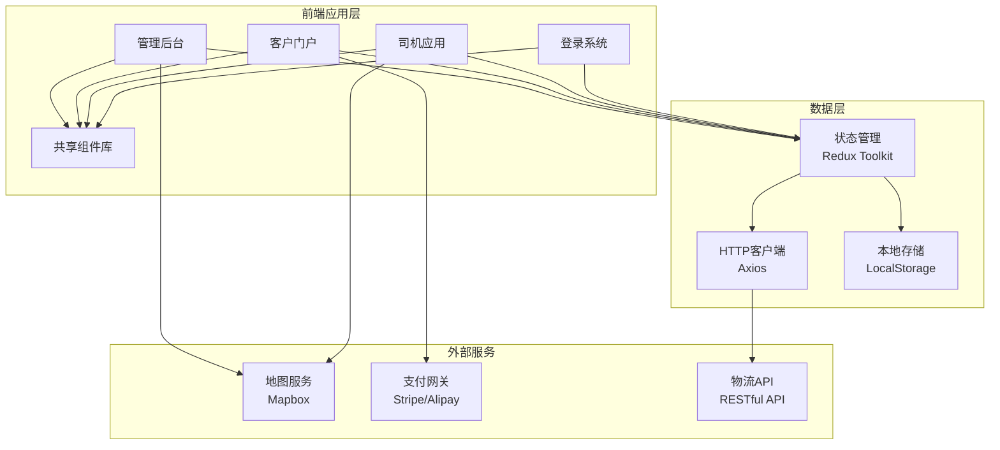

# OptiLogix 物流优化系统

<div align="center">


**现代化智能物流管理平台**

[](https://reactjs.org/)
[](https://www.typescriptlang.org/)
[](https://vitejs.dev/)

[快速开始](#快速开始) • [功能特性](#功能特性) • [架构设计](#架构设计) • [部署指南](#部署指南)

</div>

## 📋 项目概述

OptiLogix是一个基于现代前端技术栈构建的智能物流优化系统，旨在为物流企业提供全方位的数字化解决方案。系统采用模块化设计，包含管理后台、客户门户、司机应用和登录系统四个核心模块，实现了从订单管理到配送执行的全流程数字化覆盖。

### 🎯 核心价值

- **智能化决策**: 基于3D可视化和AI算法的装载规划与路径优化
- **全流程覆盖**: 从客户下单到司机配送的完整业务链路
- **实时协同**: 多角色实时协作，信息透明化
- **移动优先**: 响应式设计，完美支持移动端操作
- **高可扩展性**: 模块化架构，支持功能快速迭代

## ✨ 功能特性

### 🏢 管理后台 (Admin Dashboard)
- **3D装载规划**: 可视化货物装载，最大化空间利用率
- **智能路径优化**: 多维度算法优化配送路线，降低成本
- **实时数据监控**: 全局业务数据可视化展示
- **订单管理**: 订单全生命周期管理和异常处理
- **司机调度**: 智能分配任务，实时监控司机状态

### 🛒 客户门户 (Customer Portal)
- **在线下单**: 简便快捷的订单创建流程
- **实时跟踪**: 货物位置和配送状态实时更新
- **历史订单**: 完整的订单历史记录和数据统计
- **智能推荐**: 基于历史数据的个性化服务推荐
- **电子支付**: 集成多种支付方式

### 🚚 司机应用 (Driver App)
- **任务管理**: 清晰的任务列表和执行指引
- **3D装载指导**: 直观的装载顺序和方法指导
- **智能导航**: 集成地图服务，实时路况规避
- **电子签收**: 数字化签收流程，减少纸质单据
- **异常上报**: 快速上报和处理配送异常

### 🔐 登录系统 (Login System)
- **统一身份认证**: 支持多种登录方式
- **细粒度权限控制**: 基于角色的访问控制(RBAC)
- **会话管理**: 安全的用户会话管理机制
- **单点登录**: 企业级SSO集成支持

## 🏗️ 技术架构

### 前端技术栈
```
React 19.2.0      # 现代化前端框架
TypeScript 5.8.2   # 类型安全的JavaScript超集
Vite 6.2.0         # 高性能构建工具
```

### 核心依赖库
```json
{
  "ui": "@mui/material",           // Material-UI组件库
  "maps": "mapbox-gl",             // 地图服务
  "3d": "three",                   // 3D渲染引擎
  "charts": "recharts",            // 数据可视化
  "routing": "react-router-dom",   // 路由管理
  "state": "@reduxjs/toolkit",     // 状态管理
  "forms": "react-hook-form",      // 表单处理
  "http": "axios",                 // HTTP客户端
  "utils": "lodash",               // 工具函数库
  "testing": "vitest",             // 单元测试
  "e2e": "playwright"              // 端到端测试
}
```

### 系统架构图



## 📁 项目结构

```
optilogix/
├── admin-dashboard/          # 管理后台
│   ├── src/
│   │   ├── components/       # 业务组件
│   │   ├── pages/           # 页面组件
│   │   ├── hooks/           # 自定义Hooks
│   │   ├── services/        # API服务
│   │   └── utils/           # 工具函数
│   ├── public/              # 静态资源
│   └── package.json         # 依赖配置
│
├── customer-portal/         # 客户门户
│   └── [类似结构]
│
├── driver-app/              # 司机应用
│   └── [类似结构]
│
├── login-system/            # 登录系统
│   └── [类似结构]
│
├── shared/                  # 共享资源
│   ├── components/          # 通用组件
│   ├── utils/              # 工具函数
│   ├── types/              # TypeScript类型定义
│   └── constants/          # 常量定义
│
├── docs/                   # 项目文档
├── scripts/                # 构建脚本
└── README.md              # 项目说明
```

## 🚀 快速开始

### 环境要求
- Node.js >= 18.0.0
- npm >= 9.0.0 或 yarn >= 1.22.0
- 现代浏览器 (Chrome, Firefox, Safari, Edge)

### 安装依赖

```bash
# 克隆项目
git clone https://github.com/your-org/optilogix.git
cd optilogix

# 安装主项目依赖
npm install

# 安装各模块依赖
npm run install:all
```

### 开发环境启动

```bash
# 启动所有开发服务
npm run dev

# 或单独启动各模块
npm run dev:admin      # 管理后台 (http://localhost:5173)
npm run dev:customer   # 客户门户 (http://localhost:5174)
npm run dev:driver     # 司机应用 (http://localhost:5175)
npm run dev:auth       # 登录系统 (http://localhost:5176)
```

### 构建部署

```bash
# 构建所有模块
npm run build

# 构建特定模块
npm run build:admin
npm run build:customer
npm run build:driver
npm run build:auth
```

## 🔧 开发指南

### 代码规范
项目使用ESLint和Prettier进行代码格式化和质量检查：

```bash
# 代码检查
npm run lint

# 自动修复
npm run lint:fix

# 格式化代码
npm run format
```

### 提交规范
使用Conventional Commits规范：

```bash
# 功能特性
git commit -m "feat(admin): 添加3D装载规划功能"

# 问题修复
git commit -m "fix(driver): 修复导航路径计算错误"

# 文档更新
git commit -m "docs: 更新API文档"
```

### 测试
```bash
# 运行单元测试
npm run test

# 运行E2E测试
npm run test:e2e

# 测试覆盖率
npm run test:coverage
```

## 📚 文档

- [API文档](./docs/api.md)
- [组件库文档](./docs/components.md)
- [部署指南](./docs/deployment.md)
- [故障排除](./docs/troubleshooting.md)
- [贡献指南](./docs/contributing.md)

## 🤝 贡献

我们欢迎所有形式的贡献！请查看[贡献指南](./docs/contributing.md)了解详细信息。

### 开发流程
1. Fork项目
2. 创建功能分支 (`git checkout -b feature/amazing-feature`)
3. 提交更改 (`git commit -m 'feat: 添加某个功能'`)
4. 推送到分支 (`git push origin feature/amazing-feature`)
5. 创建Pull Request

## 📄 许可证

本项目采用MIT许可证 - 查看[LICENSE](LICENSE)文件了解详情。

## 👥 团队

- **产品负责人**: [姓名](mailto:email@example.com)
- **技术负责人**: [姓名](mailto:email@example.com)
- **UI/UX设计**: [姓名](mailto:email@example.com)

## 📞 支持

如果您在使用过程中遇到问题，可以通过以下方式获取帮助：

- 📧 邮箱: support@optilogix.com
- 💬 在线客服: [客服链接]
- 📖 文档中心: [文档链接]
- 🐛 问题反馈: [GitHub Issues]

---

<div align="center">

**[⬆ 返回顶部](#optilogix-物流优化系统)**

Made with ❤️ by OptiLogix Team

</div>